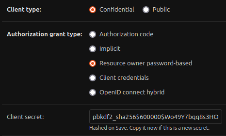

# django-oauth2-boilerplate
**Introduction:**

Comprehensive starting point for creating high-performance web applications powered by Django, S3 and oauth provider. Leverage the seamless integration of these technologies to provide lightning-fast search results and enhanced user experiences.

Th perposed by the following configuration is to simplify the creation of a microservice that could be used to control the authentication and authorization process of the application and integrate it into the  application  itself. 
    

**Overall Objective:**

The primary objective of this boilerplate is to provide a structured foundation for building web applications that require robust search functionality. By combining the power of Django, Amazon S3, and Elasticsearch, we aim to offer developers a scalable and efficient solution for their projects.


## Table of Contents

- [Rest API](#restapi)

- [Language & Technologies we used](#language_and_technologies)

- [Requirements](#requirements)

- [Getting Started](#getting-started)

- [API Documentation](#api-documentation)

- [Contributing](#contributing)

- [License](#license)

 

## REST API

 

REST is acronym for REpresentational State Transfer. It is architectural style for distributed hypermedia systems.

Like any other architectural style, REST also does have it’s own 6 guiding constraints which must be satisfied if an interface needs to be referred as RESTful.

These principles are listed below.

 

## Language & Technologies we used

- **Django**: Django is a high-level Python web framework known for its simplicity and speed. It forms the core of this boilerplate, offering a secure and extensible backend.

- **Django REST Framework**: Django REST Framework is employed to create RESTful APIs for your application, simplifying data interaction across various clients, including web and mobile apps.

- **Swagger**: Swagger is integrated for API documentation, making it easier to understand and utilize your APIs.

- **Redis**: Redis is a high-performance, in-memory data structure store. It's used for tasks such as caching, session storage, and more, to enhance the speed and responsiveness of your application.

- **PostgreSQL**: PostgreSQL is a powerful, open-source relational database. It serves as the primary database management system for your application.

- **Amazon S3**: Amazon S3 (Simple Storage Service) is a scalable object storage service used for storing and retrieving user-generated content like images, videos, and other media files.

- **AWS**: Amazon Web Services (AWS) provides cloud computing services and infrastructure. It's used for hosting and deploying your application to a production environment.

- **Docker**: Docker is a containerization platform that streamlines the deployment and scaling of applications, making it easier to manage your development and production environments.


## Requirements

Make sure you have the following software installed on your system:

- Docker: [https://docs.docker.com/get-docker/](https://docs.docker.com/get-docker/)

- Docker Compose: [https://docs.docker.com/compose/install/](https://docs.docker.com/compose/install/)

 

## Getting Started

 To get started with this boilerplate for your project, follow these steps:

### 1. Clone the repository to your local machine:


   ```bash

   git clone https://github.com/your-username django-elasticsearch-boilerplate.git

   ```

### 2. Create a .env file in the project root and add necessary environment variables.

   We have attached  file under [env.example]() to see all what you need as Environment variables.

 

### 3. Build the Docker images and start the containers:
   we have 2 docker-compose files nedded to be used, 


- **docker-compose.yml** : contain localstack (S3) service :

   ```bash

   docker-compose -f localstack-docker-compose.yml up --build

   ```
   > exec the localstack container and run :
   >
   > aws --endpoint-url=http://localhost:4566 s3api create-bucket --bucket users --region us-east-1
    

- **docker-compose.yml** : contain django, redis, postgres and celery :

   ```bash

   docker-compose -f docker-compose.yml up --build

   ```

### 4. Once the containers are up and running, the application should be accessible at http://localhost:8000/.

 

## API Documentation

1. API documentation with swagger http://localhost:8000/swagger.

2. You can find our API documentation on Postman teams collection called ''


### This is thr oauth application configuration 



## Contributing

## License
